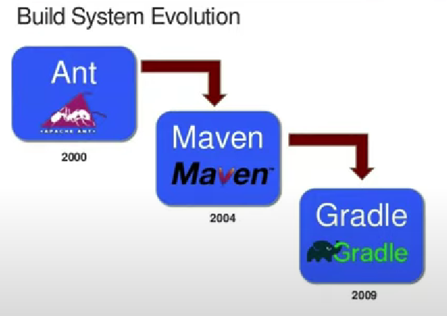

# KHÁI NIỆM DEPENDENCY MANAGEMENT. TẠI SAO PHẢI PHẢI DEPENDENCY MANAGEMENT?

---

Dependecy management là quản lý các thư viện phụ thuộc

- Maven sẽ quản lý bên file pom.xml và các thư viện được cài đặt trong các thẻ
- Gradle (sẽ quản lý trên file build gradle, được viết dưới dạng Groovy)

Lưu ý: Gradle ra đời sau sẽ khắc phục những nhược điểm của Ant, Maven và nó hỗ trợ được nhiều ngôn ngữ hơn

# KHÁI NIỆM PACKAGING, MỤC ĐÍCH?

là quá trình thực hiện đóng gói trước khi deploy lên hosting, cloud

cả Ant, Maven, Gradle đều thực hiện được công việc này.