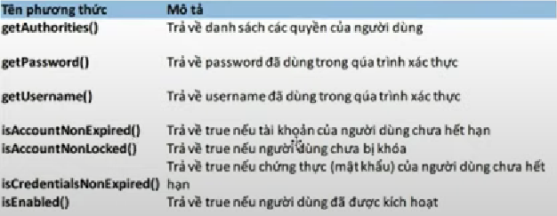

# Khái niệm về Authentication
Authentication là 1 hành động nhằm thiết lập hoặc chứng thực 1 thông điệp hoặc đối tượng nào đó là đáng tin cậy => hệ thống sẽ tin vào những lời khai báo cũng như thông điệp từ đối tượng ấy đưa ra
# Cơ chế xác thực
- HTTP basic: xác thực thông qua username và password.
- Cookies
- JWT (Json web token): là tiêu chuẩn mở (RFC-7519) định nghĩa các thức truyền tin an toàn giữa các thành viên bằng 1 JSON. Xác thực và đánh dấu là tin cậy bởi "chữ ký" của nó. Phần chữ ký của JWT sẽ được mã hóa bằng HMAC và RSA
    - JWT có 3 thành phần chính:
        - Tiêu đề, chứa loại mã thông báo và thuật toán băm
        - Tải trọng: chứa xác nhận quyền sở hữu (thông tin cá nhân: username, địa chỉ,... trừ password)
        - chữ kí
- Signature: chữ kí số: sử dụng 1 cặp khóa công khai- bảo mật và qua đó cố thể ký các văn bản điện tử cũng như trao đổi thông tin mật.
- OTP(one time password)
- Oauth 2: xác thực thông qua các ứng dụng khác: gg, facebook,...
- Mã QR.
# Spring Sercurity và các thành phần
- Spring security là 1 dự án của Spring Framework(nổi bật) cung cấp các dịch vụ bảo mật toàn diện cho các ứng dụng Java EE
- Authentication và Authorization
- Authentication là quá trình thiết lập 1 đối tượng pricipal (1 người, 1 thiết bị hoặc 1 ứng dụng khác, ...) mà có thể truy cập vào được ứng dụng của chúng ta.(xác thực)
- Authorization là tiến trình quyết định xem liệu rằng 1 pricipal có thể thực hiện 1 hành động trong ứng dụng không (phân quyền)
- Các thành phần trong ứng dụng Spring Security.
    - Security Context là 1 interface: lưu trữ tất cả các chi tiết liên quan đến bảo mât. Khi kích hoạt Spring security => kích hoạt Security Context.
    - SecurityContextHolder để truy cập vào Security Context => gồm chi tiết của principal đang tương tác với ứng dụng.
    - UserDetails: là 1 interface, đại diện cho 1 principal

# Khái niệm về Authorization?
Hay còn gọi là Access-Control là tiến trình quyết định xem 1 pricipal có được phép thực hiện 1 hành động trong ứng dụng không. Trước khi diễn ra quá trình Authorization thì pricipal phải được thiết lập bởi Authentication.
# Khái niệm và phân biệt CSRF và XSS
- CSRS là gì? là kỹ thuật tấn công bằng cách sử dụng quyền chứng thwucj của người dùng đối với 1 website. CSRS là kỹ thuật tấn công vào người dùng, dựa vào đó hacker có thể thực thi những thao tác phải yêu cầu chứng thực.
- XSS là gì? Tiêm 1 đoạn mã độc vào trong trang web. Đây là 1 trong các cách tấn công phổ biến nhất hiện tại. Khi có cuộc tấn công XSS trên trang web, mã sẽ thực thi trong trình duyệt của người dùng => đánh cắp các thông tin (cookie) của người dùng để xem thông tin hoặc giả mạo người dùng.