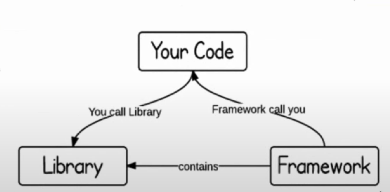
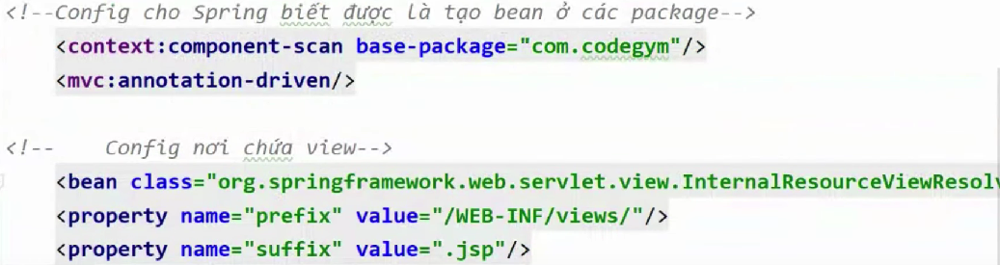

# TRÌNH BÀY KHÁI NIỆM VÀ Ý NGHĨA FRAMEWORK

---

nó là các ứng dụng phần mềm có tính trừu tượng (abstraction), cung cấp các tính năng chung, thông dụng có thể tùy biến để tạo nên các ứng dụng cụ thể khác nhau

=> mỗi 1 Framework sẽ cung cấp 1 phương pháp riêng biệt để phát triển và xây dựng lên ứng dụng

1 vài Framework phổ biến hiện nay: Spring Framework, Java Collections Framework

- Framework bao gồm môi trường tổng thể, tái sử dụng được nhằm cung cấp các chức năng, công cụ để hỗ trợ quá trình phát triển ứng dụng.

# PHÂN BIỆT FRAMEWORK VÀ LIBRARY

- điểm khác biệt lớn nhất của Framework và library là **IOC - inversion of control**

# GIỚI THIỆU CÁC THÀNH PHẦN CỦA SPRING FRAMEWORK

## Spring là gì?

- Spring là Framework nó hỗ trợ phát triển các ứng dụng liên quan đến ngôn ngữ java, nó đang là 1 framework tốt nhất hiện nay.

- Nó là 1 mã nguồn mở => được support bởi 1 cộng đồng lớn

Tham khảo 1 vài trang web:

- Baedung

- Oracle

## Các thành phần của Spring Framework

- Spring core: Thành phần cốt lõi của ứng dụng Spring. Đây chính là nền tảng để xây dựng nên các thành phần khác trong hệ sinh thái Spring Framework.

- Spring bean: Là trung tâm của Spring core: quản lý các Bean (POJO)=> Bean được hiểu là các object java cơ bản. => phục vụ cho **Design Pattern Singleton**

- Spring context: Thành phần mang mọi thứ lại với nhau.

- Spring Expression Language(SpEL): là ngôn ngữ cấu hình Spring.

# TỔNG QUAN VỀ SPRING WEB MVC

- Spring MVC là 1 nền tảng mã nguồn mở để phát triển ứng dụng java

- Được cài đặt các tính năng đầy đủ của MVC pattern

- Khác mô hình mvc truyền thống là nó cung cấp Front Controller để xử lý và lắng nghe mỗi khi có request đến ứng dụng.

- Lợi ích của front controller: bảo mật, I18N(đa ngôn ngữ)...

# Demo Config ứng dụng Spring MVC

- Web.xml: khai báo điều phối, load các servlet

- Dispatcher-Servlet: khai báo cấu hình chính của Spring MVC: package chứa controller, service, repository, đường dẫn thư mục chứa view, các annotation được sử dụng,... đại diện cho front controller

- Application-Context: thường được dùng để khai báo các bean

# Khái niệm về ViewResolver

- là cơ chế để xử lý tầng view của Spring MVC => ánh xạ các tên của view sang đối tượng view tương ứng 

# Tổng kết

1. Nắm được sự khác nhau của Framework và libary

2. Các thành phần cơ bản của Spring

3. Phân biệt Spring MVC và MVC

4. Cách truyền dữ liệu từ Controller -> View

5. Nắm được cách DI

# Cách ánh xạ các thuộc tính của @RequestMapping với thuộc tính request

- Consumes: để ánh xạ đến Content-Type của request => quy định loại dữ liệu mà client gửi lên server để xử lý

- Produces: ánh xạ đến thuộc tính là Accept của request => quy định loại dữ liệu mà server được phép trả về client.

- Params: ánh xạ tới tham số của đường dẫn

- headers: dùng để ánh xạ đến header của request.

# Phân biệt @RequestParam và @PathVariable

- Giống nhau: đều dùng để lấy dữ liệu từ người dùng gửi lên

- Khác nhau:
    - Request: gửi giá trị theo cặp key-value: thường sử dụng trong form với phương thức get
    - Path: lấy dữ liệu theo dạng value: thường được lấy và sự dụng trên URL
# Khái niệm về handle method và các kiểu trả về

Trong class Controller mỗi phương thức xử lý 1 action cho 1 request => handle method

- Tham số: @Pathvariable, @RequestMapping,...
- Trả về: String, ModelAndView, void...