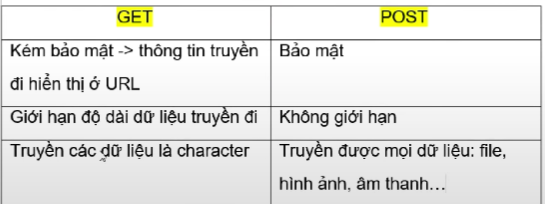

# WEB OVERVIEW

## HTTP VỚI HTTPS

---

- HTTP là tên viết tắt của HyperText Transfer Protocol (giao thức truyền tải siêu văn bản), là một giao thức cơ bản dùng cho World Wide Web (www) để truyền tải dữ liệu dưới dạng văn bản, hình ảnh, video, âm thanh và các tập tin khác từ Web server đến các trình duyệt web và ngược lại.

- Còn HTTPS là viết tắt của từ HyperText Transfer Protocol Secure và chính là giao thức HTTP có sử dụng thêm các chứng chỉ SSL (secure Sockets Layer) giúp mã hóa dữ liệu truyền tải nhằm gia bảo mật giữa Web sever đến các trình duyệt web. Nói cách khác HTTPS là phiên bản HTTP nhưng an toàn hơn, bảo mật hơn.

> cả 2 đề là giao thức truyền tải siêu văn bản.

*Siêu văn bản (tiếng Anh: hypertext) là loại văn bản tích hợp nhiều dạng dữ liệu khác nhau như: văn bản, âm thanh, hình ảnh, video,... và các siêu liên kết đến các siêu văn bản khác. Siêu văn bản là văn bản của một tài liệu có thể được truy tìm không theo tuần tự. Người đọc có thể tự do đuổi theo các dấu vết liên quan qua suốt tài liệu đó bằng các mối liên kết xác định sẵn do người sử dụng tự lập nên.*

## GET VÀ POST

 GET và POST là hai phương thức của giao thức HTTP, đều là gửi dữ liệu về server xử lí sau khi người dùng nhập thông tin vào form và thực hiện submit. Trước khi gửi thông tin, nó sẽ được mã hóa bằng cách sử dụng một giản đồ gọi là url encoding. Giản đồ này là các cặp name/value được kết hợp với các kí hiệu = và các kí hiệu khác nhau được ngăn cách bởi dấu &.

>name=value1&name1=value2&name2=value3 

### 1. GET
Phương thức GET gửi thông tin người dùng đã được mã hóa thêm vào trên request trang:

```
http://www.example.com/index.htm?name=value1&name1=value1
```
Chúng ta thấy rằng GET lộ thông tin trên đường dẫn URL. Băng thông của nó chỉ khoảng 1024 kí tự vì vây GET hạn chế về số kí tự được gửi đi. **GET không thể gửi dữ liệu nhị phân , hình ảnh** ... Có thể cached và được bookmark (đánh dấu trên trình duyệt). Lưu trong browser history.

### 2. POST

Phương thức POST truyền thông tin thông qua HTTP header, thông tin này được mã hóa như phương thức GET. Dữ liệu đươc gửi bởi phương thức POST rất bảo mật vì dữ liệu được gửi ngầm, không đưa lên URL, bằng việc sử dụng Secure HTTP, bạn có thể chắc chắn rằng thông tin của mình là an toàn. Parameters được truyền trong request body nên có thể truyền dữ liệu lớn, hạn chế tùy thuộc vào cấu hình của Server. Không cache và bookmark được cũng như không được lưu lại trong browser history. POST không có bất kì hạn chế nào về kích thước dữ liệu sẽ gửi, có thể gửi dữ liệu nhị phân, hình ảnh.

### 3. SO SÁNH GET VÀ POST

**Lưu trữ (cache)** Dữ liệu gửi bằng phương thức GET sẽ được lưu trữ lại trong query string và có thể được xem trong lịch sử trình duyệt. Ngược lại thì dữ liệu và địa chỉ URL của các request gửi bằng POST không được trình duyệt lưu lại. **Tốc độ** GET nhanh hơn rất nhiều so với POST về quá trình thực thi vì dữ liệu gửi đi luôn được webrowser cached lại, khi dùng phương thức POST thì server luôn thực thi và trả kết quả cho client, còn dùng GET thì webrowser cached sẽ kiểm tra có kết quả tương ứng đó trong cached chưa, nếu có thì trả về ngay mà không cần đưa tới server. **Đánh dấu (bookmark)** Đối với request gửi bằng phương thức GET người dùng có thể bookmark lại được trên trình duyệt. Ngược lại các request gửi bằng POST sẽ không thể bookmark được. **Gửi lại** form Với form gửi đi bằng phương thức GET bạn có thể gửi lại bằng cách bấm phím F5 hoặc Ctrl + R. Tuy nhiên với phương thức POST, nếu bạn muốn thực hiện việc gửi lại dữ liệu của form thì trình duyệt sẽ hiển thị một hộp thoại cảnh báo. **Trở lại trang trước** Trong trường hợp bạn đã gửi form dữ liệu đi rồi sau đó bấm phím Backspace để quay lại trang trước thì với phương thức GET bạn sẽ vẫn được cùng một nội dụng (chứa form). Ngược lại với POST thì bạn sẽ thấy một trang trống. **Bảo mật** Phương thức POST bảo mật hơn GET vì dữ liệu được gửi ngầm, không xuất hiện trên URL, dữ liệu cũng không được lưu lại trong khi đó với GET thì bạn có thể hiển thị lại được các dữ liệu này. **Dữ liệu** Phương thức POST không giới hạn dung lượng dữ liệu gửi đi cũng như loại nhữ liệu (văn bản thông thường hay file nhị phân như upload tập tin hay hình ảnh, video...). Ngược lại, với phương thức GET dữ liệu gửi đi bị giới hạn sử dụng các ký tự chữ có trong bộ ký tự ASCII. Đồng thời dữ liệu của GET được gửi trong URL thông qua query string nên sẽ bị giới hạn bởi số lượng ký tự tối đa cho phép trong URL.



### 4. SỰ LỰA CHỌN

Qua những phân tích trên, GET và POST nên được sử dụng như sau:

- Khi lấy dữ liệu nên dùng GET để truy xuất và xử lí nhanh hơn.
- Khi tạo dữ liệu nên dùng POST để bảo mật dữ liệu hơn. Một ví dụ cụ thể như trong trường hợp bạn cần tạo một form để người dùng upload avatar hay video thì chúng ta thường sẽ sử dụng phương thức POST. Tuy nhiên khi tải về avatar hoặc video thì bạn lại nên sử dụng phương thức GET. Ngoài ra khi cần xử lý các thông tin nhạy cảm ví dụ như email, password thì bạn cần sử dụng POST thay vì GET.

## JSP VÀ SERVLET

---

### SERVLET

- java servlet là bộ thư viện đầu tiên hỗ trợ chúng ta viết websites

- mọi framework hay jsp đều biên dịch về servlet và chạy trên máy ảo jvm

- hỗ trợ nhiều interface và class trong lập trình web

#### Điểm mạnh Servlet

- Hiệu suất tốt: dùng thread cho mỗi request

- Linh động: ngôn ngữ java

- Mạnh mexL JVM quản lý bộ nhớ, xóa rác

- bảo mật: bảo mật của java

##### TOMCAT

> là 1 server hỗ trợ chạy các java servlet

#### CHU KÌ SERVLET VÀ VÍ DỤ

- Servlet là cách gọi tắt của 1 đối tượng trong bộ nhớ heap

- Chu kì sống của servlet được bắt đầu khi ta tạo 1 đối tượng servlet mới. Khi chúng ta tạo 1 đối tượng servlet mới thì hàm init() được gọi. Khi đối tượng này bị xóa đi thì sẽ gọi hàm destroy();

- khi đối tượng này tồn tại trong bộ nhớ heap thì sẽ có hàm service và hàm này sẽ đón nhận các request từ client gửi lên và trả về response

[tài liệu tham khảo](https://www.youtube.com/watch?v=I-OjMUFw0_0&list=PLsfLgp1K1xQ53rzo7vo2dKamBu0bj7lkv&index=3)